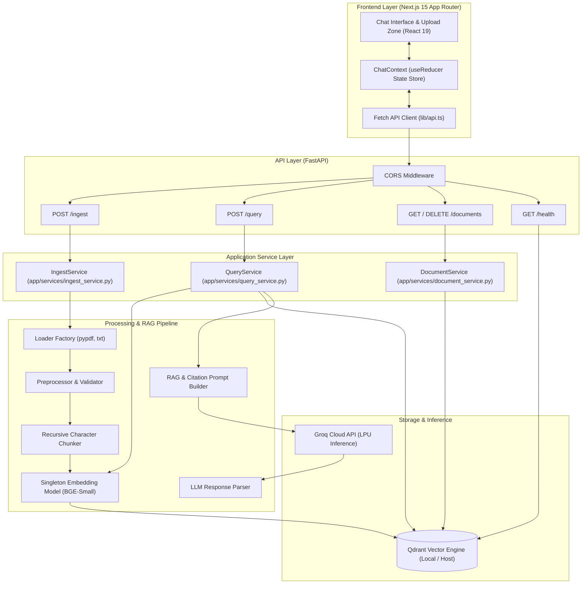
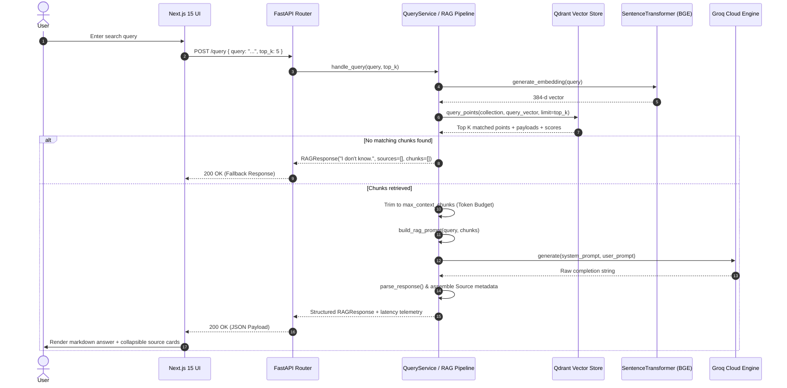
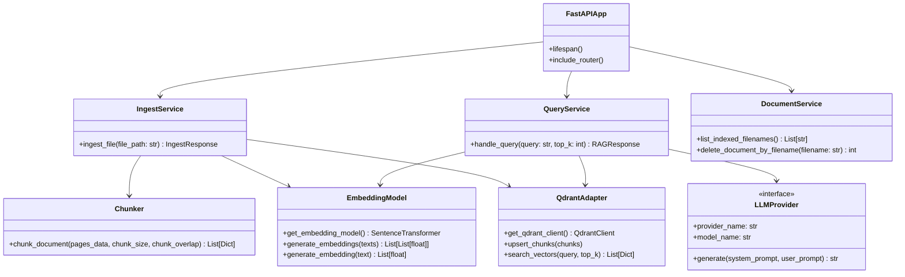
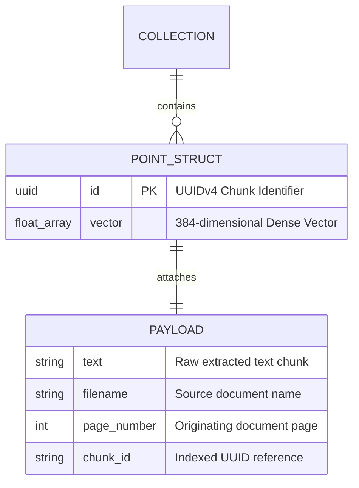
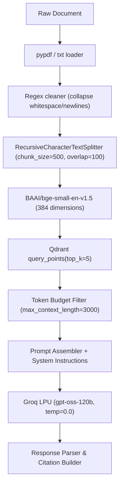
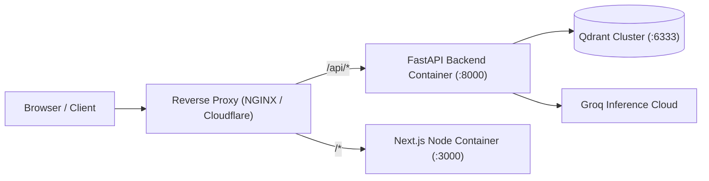

# Enterprise RAG Platform

<div align="center">


<br />

**A high-performance, production-grade Retrieval-Augmented Generation (RAG) system with session-based document ingestion, hybrid chunking, local vector storage, strict citation grounding, and ultra-low latency Groq inference.**

</div>

---

## 📑 Table of Contents

- [Overview](#-overview)
- [Architecture](#-architecture)
  - [High-Level Architecture](#high-level-architecture)
  - [System Component Interaction](#system-component-interaction)
  - [Document Ingestion Pipeline](#document-ingestion-pipeline)
  - [Query & Retrieval Sequence](#query--retrieval-sequence)
- [Technology Stack](#-technology-stack)
- [Project Structure](#-project-structure)
- [Features](#-features)
- [System Architecture & Layer Responsibilities](#-system-architecture--layer-responsibilities)
- [Data Flow Lifecycle](#-data-flow-lifecycle)
- [API Documentation](#-api-documentation)
- [Database & Vector Store Internals](#-database--vector-store-internals)
- [AI Pipeline Specifications](#-ai-pipeline-specifications)
- [Security & Validation](#-security--validation)
- [Installation & Setup](#-installation--setup)
- [Environment Variables](#-environment-variables)
- [Configuration](#-configuration)
- [Running Tests](#-running-tests)
- [Deployment Guide](#-deployment-guide)
- [Performance & Optimization](#-performance--optimization)
- [Logging and Monitoring](#-logging-and-monitoring)
- [Screenshots & UI Showcase](#-screenshots--ui-showcase)
- [Future Roadmap](#-future-roadmap)
- [Contributing](#-contributing)
- [License](#-license)
- [Acknowledgements](#-acknowledgements)

---

## 📖 Overview

The **Enterprise RAG Platform** is an end-to-end document intelligence and question-answering solution. It solves the critical enterprise challenges of knowledge retrieval, model hallucination, context window limitations, and latency in conversational AI workflows.

### Why It Exists
Enterprises possess massive corpora of unstructured knowledge (PDF reports, technical manuals, plain-text documents). Standard Large Language Models (LLMs) struggle with factual drift, lack domain-specific enterprise knowledge, and cannot provide verified audit trails. This platform guarantees:
1. **Zero Unbounded Hallucinations**: Enforces strict context grounding via system prompts and deterministic fallback (`"I don't know."`).
2. **Deterministic Source Attribution**: Inspectable file name, page number, chunk ID, and cosine similarity score per citation.
3. **Sub-Second Token Generation**: Integrates Groq LPU inference accelerators paired with local HuggingFace embedding models.
4. **Zero Cloud Lock-in Vector Storage**: Embedded or networked Qdrant vector database engine.

### Main Capabilities
- **Multi-Format Ingestion**: Streaming multipart ingestion for PDF and TXT documents.
- **Preprocessing & Cleaning**: Whitespace normalization, newline compaction, and minimum-entropy validation.
- **Deterministic Chunking**: Token-aware recursive text splitting with configurable chunk sizing and overlap windows.
- **Local Embedding Vectorization**: Pre-warmed singleton `BAAI/bge-small-en-v1.5` embeddings (384-dimensional dense vectors).
- **Embedded / Distributed Vector Search**: Native Qdrant `query_points` API integration with cosine distance metric.
- **Extensible LLM Provider Architecture**: Factory-managed provider abstractions with built-in Groq support.
- **Modern Next.js 15 Client**: Dark-mode glassmorphic chat interface with real-time markdown parsing, code syntax highlighting, latency telemetry, and interactive citation popovers.

### Target Users
- Enterprise Knowledge Teams & Document Auditors
- AI/ML Engineers building production-ready RAG pipelines
- Developers requiring a decoupled FastAPI + Next.js template for enterprise search

---

## 🏗 Architecture

### High-Level Architecture



---

### System Component Interaction



---

### Document Ingestion Pipeline

```mermaid
flowchart LR
    Upload["File Upload (.pdf / .txt)"] --> Temp["Temporary Disk Buffer"]
    Temp --> Detect{"Extension Dispatch"}
    Detect -->|PDF| PyPdf["pypdf Loader (Page-by-page extraction)"]
    Detect -->|TXT| TxtRead["UTF-8 Raw Text Loader"]
    
    PyPdf & TxtRead --> Clean["Regex Cleaner (Whitespace/Newline normalizer)"]
    Clean --> Validate{"Length >= 10 chars?"}
    Validate -->|No| Discard["Reject Empty Page"]
    Validate -->|Yes| Chunk["LangChain Recursive Splitter (Size: 500, Overlap: 100)"]
    
    Chunk --> UUID["Inject Unique chunk_id (UUIDv4)"]
    UUID --> Embed["Generate Dense Vector (BGE-Small-EN-v1.5)"]
    Embed --> Upsert["Batch Upsert to Qdrant (PointStruct payload)"]
    Upsert --> Resp["Return IngestResponse (Chunks count, latency)"]
```



---

## 🛠 Technology Stack

### Core Frameworks & Runtime

| Component | Technology | Version | Purpose |
|---|---|---|---|
| **Backend Runtime** | Python | `3.11+` / `3.12+` | High-performance asynchronous execution runtime |
| **Backend Framework** | FastAPI | `>=0.111.0` | Asynchronous REST API routing, Pydantic validation, OpenAPI docs |
| **ASGI Server** | Uvicorn (Standard) | `>=0.30.0` | High-throughput asynchronous web server |
| **Frontend Framework** | Next.js (App Router) | `16.2.12` | React server-side rendering, client component tree, asset bundling |
| **UI Library** | React / React-DOM | `19.2.4` | Modern component UI with hooks and Context API |
| **Styling Engine** | Tailwind CSS / PostCSS | `v4` | Utility-first CSS engine with dark mode styling |

### AI, NLP & Storage

| Component | Technology | Specification | Details |
|---|---|---|---|
| **LLM Provider** | Groq Cloud API | `openai/gpt-oss-120b` | Ultra-fast LPU inference (`temperature=0.0`, `max_tokens=1024`) |
| **Fallback LLM Provider** | Ollama Engine | `llama3` | Configured abstraction for local inference (`app/llm/ollama_client.py`) |
| **Embedding Engine** | Sentence-Transformers | `BAAI/bge-small-en-v1.5` | 384-dimensional dense semantic embedding model |
| **Vector Database** | Qdrant Client | `>=1.10.0` | Local disk storage (`./qdrant_storage`) or networked cluster |
| **Distance Metric** | Cosine Similarity | Normalized dot product | Fast directional vector similarity measurement |
| **Document Loaders** | `pypdf`, Native I/O | `>=4.3.1` | Page-aware PDF stream parser and UTF-8 text loader |
| **Text Splitter** | LangChain Text Splitters | `>=0.2.2` | Recursive character-level token-aware boundary chunker |

### Validation, Tooling & Testing

| Category | Tool | Specification |
|---|---|---|
| **Configuration & Schema** | Pydantic & Pydantic-Settings | Settings validation, request/response models, auto `.env` parsing |
| **Icons & Typography** | Lucide React | Modern feather-light scalable SVG iconography |
| **Markdown Rendering** | `react-markdown`, `remark-gfm`, `highlight.js` | GFM tables, strikethrough, syntax highlighted code blocks |
| **Testing Framework** | `pytest`, `pytest-asyncio`, `httpx` | Unit and integration test suite with mock fixtures |
| **Logging** | Python `logging` Standard Library | Structured timestamped logging (`INFO`/`DEBUG`) with third-party silencing |

---

## 📂 Project Structure

```text
ragpineline/
├── .env.example                               # Environment configuration template
├── main.py                                    # FastAPI application entrypoint & lifespan management
├── requirements.txt                           # Backend Python dependencies
├── app/                                       # Core Backend Application Package
│   ├── __init__.py
│   ├── api/                                   # REST API Layer
│   │   ├── __init__.py
│   │   ├── dependencies.py                    # Shared dependency injection fixtures
│   │   └── routes/                            # Route Handlers
│   │       ├── __init__.py
│   │       ├── documents.py                   # GET /documents, DELETE /documents/{filename}
│   │       ├── health.py                      # GET /health (Deep system & Qdrant verification)
│   │       ├── ingest.py                      # POST /ingest (Multipart file upload)
│   │       └── query.py                       # POST /query (Natural language search & answer)
│   ├── chunking/                              # Document Chunking Engine
│   │   ├── __init__.py
│   │   └── chunker.py                         # Recursive character splitting with UUIDv4 generation
│   ├── config/                                # Centralized Settings & Logging
│   │   ├── __init__.py
│   │   ├── constants.py                       # Application constants (extensions, provider IDs)
│   │   ├── logging.py                         # Structured logging formatter and logger factory
│   │   └── settings.py                        # Pydantic BaseSettings loading .env
│   ├── embeddings/                            # Vector Embeddings Subsystem
│   │   ├── __init__.py
│   │   ├── embedding_model.py                 # Lazy-loaded SentenceTransformer singleton
│   │   └── embedding_service.py               # Batch and single text vectorization methods
│   ├── llm/                                   # Large Language Model Provider Layer
│   │   ├── __init__.py
│   │   ├── base_provider.py                   # BaseLLMProvider abstract interface
│   │   ├── groq_client.py                     # Groq Cloud API implementation
│   │   ├── model_manager.py                   # Model registry helpers
│   │   ├── ollama_client.py                   # Local Ollama HTTP provider
│   │   ├── provider_factory.py                # LLM Provider Factory and provider caching
│   │   └── response_parser.py                 # String normalization and fallback parsing
│   ├── loaders/                               # Document Ingestion Loaders
│   │   ├── __init__.py
│   │   ├── loader_factory.py                  # Extension router dispatching to loaders
│   │   ├── pdf_loader.py                      # pypdf page-by-page extractor
│   │   └── txt_loader.py                      # UTF-8 text file reader
│   ├── models/                                # Pydantic Schemas & DTOs
│   │   ├── __init__.py
│   │   ├── metadata_models.py                 # ChunkMetadata schema
│   │   ├── request_models.py                  # QueryRequest, IngestURLRequest
│   │   └── response_models.py                 # RAGResponse, IngestResponse, HealthResponse, etc.
│   ├── preprocessing/                         # Text Sanitization
│   │   ├── __init__.py
│   │   ├── cleaner.py                         # Whitespace & newline regex cleaning
│   │   └── validator.py                       # Minimum length / non-empty validator
│   ├── prompt/                                # Prompt Engineering & Templates
│   │   ├── __init__.py
│   │   ├── citation_prompt.py                 # Citation formatting instructions
│   │   ├── prompt_builder.py                  # Legacy prompt compiler
│   │   ├── rag_prompt.py                      # Token-budgeted context + query prompt builder
│   │   ├── system_prompt.py                   # Strict anti-hallucination system prompt contract
│   │   └── templates.py                       # Base prompt formatting templates
│   ├── rag/                                   # Pipeline Orchestration
│   │   ├── __init__.py
│   │   ├── answer_generator.py                # Generation helper
│   │   └── rag_pipeline.py                    # End-to-end retrieval, prompt assembly, and inference
│   ├── retrieval/                             # Semantic Retrieval Engine
│   │   ├── __init__.py
│   │   └── retriever.py                       # Top-K retrieval orchestrator & result formatter
│   ├── services/                              # Business Logic Layer
│   │   ├── __init__.py
│   │   ├── document_service.py                # Qdrant scroll pagination & document deletion
│   │   ├── ingest_service.py                  # Load → Clean → Chunk → Embed → Upsert pipeline
│   │   └── query_service.py                   # Query handler service
│   ├── tests/                                 # Automated Test Suite (Pytest)
│   │   ├── __init__.py
│   │   ├── test_api.py                        # Endpoint integration tests using FastAPI TestClient
│   │   ├── test_chunker.py                    # Unit tests for text chunking and metadata retention
│   │   ├── test_prompt_builder.py             # Prompt creation & validation tests
│   │   └── test_provider.py                   # Provider factory & Groq provider tests
│   ├── utils/                                 # General Utilities
│   │   ├── __init__.py
│   │   ├── file_utils.py                      # Extension extraction and directory scanning
│   │   └── timer.py                           # Function execution timing decorator
│   └── vectorstore/                           # Vector Store Subsystem
│       ├── __init__.py
│       ├── qdrant_client.py                   # Qdrant client singleton & auto collection setup
│       ├── search.py                          # Cosine similarity vector search via query_points()
│       └── upsert.py                          # PointStruct creation and batch upsert operations
│
└── rag-ui/                                    # Frontend Next.js Application
    ├── package.json                           # Frontend dependencies & npm scripts
    ├── tsconfig.json                          # TypeScript compiler configuration
    ├── next.config.ts                         # Next.js configuration
    ├── app/                                   # Next.js App Router
    │   ├── layout.tsx                         # Root layout with font configuration
    │   ├── page.tsx                           # Main chat application page
    │   └── globals.css                        # Global CSS & Tailwind imports
    ├── components/                            # React UI Components
    │   ├── ChatInput.tsx                      # Auto-resizing query text input & submission
    │   ├── ChatLayout.tsx                     # Two-column responsive application layout
    │   ├── ChatWindow.tsx                     # Message stream viewport with auto-scroll
    │   ├── EmptyState.tsx                     # Welcome banner and feature guidance
    │   ├── FileCard.tsx                       # Uploaded file item with status badges
    │   ├── LoadingIndicator.tsx               # Pulsing typing & processing animations
    │   ├── MessageBubble.tsx                  # Markdown message bubble with syntax highlighting
    │   ├── Sidebar.tsx                        # Document drawer & session management
    │   ├── SourceCitation.tsx                 # Expandable source attribution badges
    │   └── UploadZone.tsx                     # Drag-and-drop file upload zone
    ├── context/                               # Global State
    │   └── ChatContext.tsx                    # Centralized useReducer chat state store
    └── lib/                                   # Frontend Utilities
        ├── api.ts                             # Typed fetch client connecting to FastAPI
        └── utils.ts                           # Tailwind CSS class merger (`clsx` + `twMerge`)
```

---

## ⚡ Features

### Core Features
- **Session-Based Ingestion**: Instant drag-and-drop or file picker upload for `.pdf` and `.txt` files.
- **Dynamic File Management**: View all indexed files, chunk counts, processing statuses, and delete specific documents directly from the UI or REST API.
- **Streaming UI Feedback**: Multi-stage upload state transitions (`uploading` → `processing` → `ready` / `error`).
- **Interactive Markdown & Code Display**: Full GitHub Flavored Markdown (GFM) support, responsive data tables, quotes, lists, and formatted syntax-highlighted code blocks.

### AI & Search Features
- **Dense Vector Search**: Semantic similarity matching using cosine distance over 384-dimensional dense embeddings.
- **Token-Aware Context Budgeting**: Automatic truncation prevents context window overflow by bounding retrieved chunks to `max_context_length` (default 3,000 characters).
- **Anti-Hallucination Guardrails**: Strictly constrained system prompt instructions force the LLM to output `"I don't know."` if query answers are absent from indexed documents.
- **Traceable Citations**: Granular citations linked to specific filenames, page numbers, and vector chunk IDs.

### Developer & API Features
- **OpenAPI / Swagger Documentation**: Interactive API documentation generated automatically at `/docs` and `/redoc`.
- **Eager Singleton Pre-Warming**: Embedding models and vector databases initialize at server startup (`lifespan`) to eliminate cold-start penalties on initial requests.
- **Decoupled Architecture**: Clean separation between API Routes, Domain Services, Ingestion Loaders, Embedding Providers, and Vector Store Adapters.
- **Automated Test Coverage**: Comprehensive Pytest suite testing endpoints, text splitters, prompt constructors, and provider factories.

---

## 🏛 System Architecture & Layer Responsibilities



### Layer Breakdown
1. **API Routing Layer (`app/api/`)**: Validates HTTP payloads using Pydantic, maps exceptions to HTTP status codes (`404`, `415`, `422`, `500`, `502`), and coordinates service execution.
2. **Business Services Layer (`app/services/`)**: Implements application workflows: orchestration of ingestion pipelines, query lifecycles, and vector payload scrolling.
3. **Pipeline Layer (`app/rag/`, `app/chunking/`, `app/loaders/`, `app/preprocessing/`)**: Performs stateless text manipulation, parsing, validation, chunking, and prompt compilation.
4. **Vector Store & Embeddings Layer (`app/vectorstore/`, `app/embeddings/`)**: Encapsulates model inference (`SentenceTransformer`) and storage mutations (`QdrantClient`).
5. **Provider Layer (`app/llm/`)**: Abstraction layer allowing pluggable LLM backends (Groq, Ollama) behind a unified `generate()` contract.

---

## 🔄 Data Flow Lifecycle

```mermaid
flowchart TD
    subgraph IngestionFlow ["1. Ingestion Flow"]
        A[File Uploaded] --> B[Saved to Temporary Storage]
        B --> C[Loader parses pages]
        C --> D[Cleaner normalizes whitespace]
        D --> E[Validator filters short text]
        E --> F[Recursive text splitting]
        F --> G[Assign UUIDv4 chunk IDs]
        G --> H[Generate 384-d dense embeddings]
        H --> I[Upsert vectors & payloads to Qdrant]
        I --> J[Clean temp file & return IngestResponse]
    end

    subgraph QueryFlow ["2. Query Flow"]
        K[User sends query string] --> L[Generate query embedding]
        L --> M[Cosine similarity search in Qdrant]
        M --> N{Chunks Found?}
        N -->|No| O[Return fallback 'I don't know.']
        N -->|Yes| P[Trim to top max_context_chunks]
        P --> Q[Check token budget max_context_length]
        Q --> R[Inject Citation & System instructions]
        R --> S[Invoke Groq LLM completion API]
        S --> T[Parse response & construct Source citations]
        T --> U[Return typed RAGResponse to client]
    end
```



---

## 🔌 API Documentation

All endpoints are prefixed with the root host (`http://localhost:8000`).

| Method | Endpoint | Description | Auth Required | Request Body / Params | Status Codes |
|---|---|---|---|---|---|
| `GET` | `/` | Root health ping and documentation link | No | None | `200 OK` |
| `GET` | `/health` | Deep health check (Qdrant connectivity, LLM status, config) | No | None | `200 OK` |
| `POST` | `/ingest` | Ingests a `.pdf` or `.txt` document into the vector store | No | `multipart/form-data` (`file: UploadFile`) | `201 Created`, `415`, `422`, `500` |
| `POST` | `/query` | Executes semantic search and grounded LLM generation | No | `application/json` (`QueryRequest`) | `200 OK`, `422`, `502`, `500` |
| `GET` | `/documents` | Lists all indexed unique document filenames | No | None | `200 OK`, `500` |
| `DELETE` | `/documents/{filename}` | Deletes all chunks associated with a specific file | No | Path parameter (`filename: str`) | `200 OK`, `404`, `500` |

---

### Request & Response Examples

#### 1. Ingest Document (`POST /ingest`)
```bash
curl -X POST "http://localhost:8000/ingest" \
  -F "file=@annual_report.pdf"
```

**Response (`201 Created`):**
```json
{
  "message": "File ingested successfully.",
  "filename": "annual_report.pdf",
  "chunks_created": 14,
  "ingestion_time_ms": 342.15
}
```

#### 2. Query Documents (`POST /query`)
```bash
curl -X POST "http://localhost:8000/query" \
  -H "Content-Type: application/json" \
  -d '{
    "query": "What were the total revenues in Q3 according to the report?",
    "top_k": 5
  }'
```

**Response (`200 OK`):**
```json
{
  "answer": "According to the financial report, total revenues in Q3 reached $4.2 million, representing a 14% year-over-year increase (source: annual_report.pdf, page 4).",
  "sources": [
    {
      "filename": "annual_report.pdf",
      "page_number": 4,
      "chunk_id": "a988135a-9ff2-49d7-8495-2c83c27e81df"
    }
  ],
  "retrieved_chunks": [
    {
      "text": "Financial Summary: Q3 total revenues reached $4.2 million, an increase of 14% YoY...",
      "score": 0.8924,
      "filename": "annual_report.pdf",
      "page_number": 4,
      "chunk_id": "a988135a-9ff2-49d7-8495-2c83c27e81df"
    }
  ],
  "model": "openai/gpt-oss-120b",
  "provider": "groq",
  "latency_ms": 482.60
}
```

#### 3. Health Check (`GET /health`)
```bash
curl -X GET "http://localhost:8000/health"
```

**Response (`200 OK`):**
```json
{
  "status": "ok",
  "provider": "groq",
  "model": "openai/gpt-oss-120b",
  "qdrant": "ok",
  "details": {
    "collection": "core_rag_collection",
    "embedding_model": "BAAI/bge-small-en-v1.5",
    "top_k": 10,
    "max_context_chunks": 5
  }
}
```

---

## 🗄 Database & Vector Store Internals

The platform uses **Qdrant** as its primary vector indexing engine.



### Collection Schema & Configuration
- **Collection Name**: `core_rag_collection` (Configurable via `COLLECTION_NAME`).
- **Vector Dimension**: `384` (Matches `BAAI/bge-small-en-v1.5` output).
- **Distance Metric**: `Distance.COSINE`.
- **Storage Backend**:
  - **Embedded / Local Disk**: Saved to `./qdrant_storage` when `QDRANT_USE_LOCAL=true`.
  - **Networked Server**: Connects via `qdrant_host` and `qdrant_port` when `QDRANT_USE_LOCAL=false`.

### Data Management Operations
- **Upserting**: Uses `PointStruct` instances with payload indexing.
- **Scroll Pagination**: Uses Qdrant cursor scrolling (`client.scroll(limit=100)`) to retrieve unique filenames without pulling entire vector arrays into memory.
- **Filtering & Deletion**: Deletion utilizes Qdrant `Filter` with `FieldCondition` matched against `payload.filename`, deleting matching point IDs in an isolated batch selector.

---

## 🧠 AI Pipeline Specifications



### 1. Document Loading & Text Sanitization
- **PDF Extraction**: `pypdf.PdfReader` processes streams page-by-page, retaining 1-indexed page metadata.
- **Text Cleaning**:
  - Compresses runs of spaces and horizontal tabs into single spaces (`[ \t]+` $\to$ `' '`).
  - Normalizes line feeds and carriage returns (`[\r\n]+` $\to$ `\n`).
- **Sanity Validation**: Pages with trimmed length $< 10$ characters are discarded.

### 2. Chunking Strategy
- **Splitter**: `RecursiveCharacterTextSplitter` from `langchain-text-splitters`.
- **Chunk Size**: `500` characters.
- **Chunk Overlap**: `100` characters (ensures semantic boundary preservation across sentences).
- **Chunk Identification**: Every chunk is stamped with a unique `UUIDv4` identifier.

### 3. Embeddings & Vector Search
- **Model**: `BAAI/bge-small-en-v1.5` loaded locally via `sentence-transformers`.
- **Search Execution**: `client.query_points()` returns ranked vectors with similarity scores.

### 4. Prompt Assembly & Citation Policy
The prompt builder structures context and instructions into a strict template:

```text
You are a helpful AI assistant. Answer the user's question using ONLY the context provided below. Do not invent any information. If the answer cannot be found in the context, respond exactly with: I don't know.

Context:
[File: annual_report.pdf | Page: 4]
Financial Summary: Q3 total revenues reached $4.2 million...

When referring to information from the context, mention the source document name in parentheses, e.g. (source: report.pdf, page 3).

Question:
What were the Q3 revenues?
```

---

## 🔒 Security & Validation

- **Input Validation**: All incoming API requests are validated using strict Pydantic v2 schemas (`min_length=1` on queries, boundary constraints on `top_k: 1..20`).
- **File Type Whitelisting**: Strict extension checking against `.pdf` and `.txt`. Any other media type triggers a `415 Unsupported Media Type` rejection before reading payloads.
- **CORS Protection**: Configured via FastAPI `CORSMiddleware` with credentials, methods, and header whitelisting.
- **Safe Temporary Files**: Ingested files are buffered via `tempfile.NamedTemporaryFile` and deleted inside `finally:` blocks to prevent disk leakage.
- **Zero Key Exposure**: Client applications never interact directly with Groq; all API keys remain encapsulated inside the backend environment.

---

## 🚀 Installation & Setup

### Prerequisites
- **Python**: Version `3.11` or `3.12`
- **Node.js**: Version `18.18+` or `20+`
- **npm** / **pnpm** / **yarn**
- **Groq Cloud API Key**: Obtainable from [console.groq.com](https://console.groq.com)

---

### 1. Backend Setup

```bash
# 1. Clone the repository
git clone https://github.com/your-org/ragpineline.git
cd ragpineline

# 2. Create and activate a Python virtual environment
python3 -m venv .venv
source .venv/bin/activate  # On Windows: .venv\Scripts\activate

# 3. Install dependencies
pip install --upgrade pip
pip install -r requirements.txt

# 4. Configure environment variables
cp .env.example .env
```

Open `.env` and set your `GROQ_API_KEY`:
```ini
GROQ_API_KEY=gsk_your_actual_groq_api_key
```

```bash
# 5. Start the FastAPI development server
uvicorn main:app --reload --host 0.0.0.0 --port 8000
```

The backend server is accessible at `http://localhost:8000`. Interactive documentation is available at `http://localhost:8000/docs`.

---

### 2. Frontend Setup

```bash
# 1. Navigate to the UI directory
cd rag-ui

# 2. Install Node dependencies
npm install

# 3. Configure local environment
echo "NEXT_PUBLIC_API_URL=http://localhost:8000" > .env.local

# 4. Start the Next.js development server
npm run dev
```

The frontend chat interface is accessible at `http://localhost:3000`.

---

## ⚙️ Environment Variables

The backend application settings are managed by Pydantic's `BaseSettings`.

| Variable | Type | Default | Required | Description |
|---|---|---|:---:|---|
| `LLM_PROVIDER` | `string` | `groq` | No | Active LLM provider (`groq`) |
| `GROQ_API_KEY` | `string` | `""` | **Yes** | Groq Cloud API authentication key |
| `GROQ_MODEL` | `string` | `openai/gpt-oss-120b` | No | Model identifier on Groq |
| `QDRANT_USE_LOCAL` | `boolean` | `true` | No | Set `true` to use embedded disk storage |
| `QDRANT_PATH` | `string` | `./qdrant_storage` | No | Directory path for embedded Qdrant data |
| `QDRANT_HOST` | `string` | `localhost` | No | Remote Qdrant host (when `QDRANT_USE_LOCAL=false`) |
| `QDRANT_PORT` | `integer` | `6333` | No | Remote Qdrant port |
| `COLLECTION_NAME` | `string` | `core_rag_collection` | No | Target Qdrant collection name |
| `EMBEDDING_MODEL` | `string` | `BAAI/bge-small-en-v1.5` | No | HuggingFace embedding model name |
| `VECTOR_SIZE` | `integer` | `384` | No | Vector dimensions matching embedding model |
| `CHUNK_SIZE` | `integer` | `500` | No | Maximum characters per chunk |
| `CHUNK_OVERLAP` | `integer` | `100` | No | Character overlap between consecutive chunks |
| `TOP_K` | `integer` | `10` | No | Number of vector matches retrieved from Qdrant |
| `MAX_CONTEXT_CHUNKS` | `integer` | `5` | No | Maximum chunks passed into LLM context |
| `MAX_CONTEXT_LENGTH` | `integer` | `3000` | No | Character limit for context passed into LLM prompt |
| `APP_TITLE` | `string` | `RAG Backend API` | No | FastAPI application name in OpenAPI docs |
| `APP_VERSION` | `string` | `1.0.0` | No | API version string |
| `DEBUG` | `boolean` | `false` | No | Enables debug logging level |

---

## 🧪 Running Tests

The test suite validates API routers, text chunkers, prompt assembly, and provider abstractions using `pytest`.

```bash
# Ensure virtual environment is activated
source .venv/bin/activate

# Execute all tests with verbose output
pytest app/tests/ -v
```

### Test Suite Summary

```text
app/tests/test_api.py::test_health_endpoint PASSED             [ 11%]
app/tests/test_api.py::test_query_endpoint_success PASSED       [ 22%]
app/tests/test_api.py::test_query_endpoint_empty_query PASSED   [ 33%]
app/tests/test_api.py::test_documents_list_endpoint PASSED     [ 44%]
app/tests/test_api.py::test_documents_delete_not_found PASSED  [ 55%]
app/tests/test_chunker.py::test_chunk_document_returns_chunks PASSED [ 66%]
app/tests/test_chunker.py::test_chunk_has_required_keys PASSED  [ 77%]
app/tests/test_chunker.py::test_chunk_text_not_empty PASSED     [ 88%]
app/tests/test_chunker.py::test_chunk_ids_are_unique PASSED     [100%]
```

---

## 🚢 Deployment Guide

### Production Dockerization (Recommended Architecture)



### Production Checklist
1. **Qdrant Storage**: Transition from embedded `QDRANT_USE_LOCAL=true` to a dedicated containerized Qdrant instance (`QDRANT_USE_LOCAL=false`, `QDRANT_HOST=qdrant-server`).
2. **CORS Origins**: Adjust `allow_origins=["*"]` in `main.py` to match your production domain.
3. **Model Warmup**: Lifespan startup handler already pre-loads the SentenceTransformer model to prevent cold-start latency spikes.

---

## ⚡ Performance & Optimization

- **Pre-Warmed Singletons**: Embedding models and vector databases are eagerly loaded during FastAPI startup (`lifespan`), ensuring sub-millisecond route dispatching on the first request.
- **Low Memory Footprint**: `BAAI/bge-small-en-v1.5` provides high retrieval accuracy at 384 dimensions with low CPU/RAM resource requirements.
- **Fast LPU Inference**: Groq LPU processing yields response latencies under 500ms for typical 1,000-token completions.
- **Scroll Pagination**: Document listing inspects metadata payloads using iterative scrolling without copying dense vector indices.

---

## 📊 Logging and Monitoring

The backend implements structured logging with configurable log levels (`DEBUG`/`INFO`):

```text
2026-08-03T10:30:15 | INFO     | main     | Starting RAG Backend API v1.0.0 | provider=groq | model=openai/gpt-oss-120b
2026-08-03T10:30:16 | INFO     | app.vectorstore.qdrant_client | Connecting to local Qdrant at path=./qdrant_storage
2026-08-03T10:30:17 | INFO     | app.embeddings.embedding_model | Loading embedding model: BAAI/bge-small-en-v1.5
2026-08-03T10:30:18 | INFO     | main     | All services initialised — ready.
2026-08-03T10:32:01 | INFO     | app.rag.rag_pipeline | Retrieval started | top_k=5
2026-08-03T10:32:01 | INFO     | app.rag.rag_pipeline | Retrieval complete | docs=5 | latency=14.2 ms
2026-08-03T10:32:01 | INFO     | app.llm.groq_client | Calling Groq API | model=openai/gpt-oss-120b
2026-08-03T10:32:02 | INFO     | app.rag.rag_pipeline | Pipeline complete | total_latency=428.3 ms
```

---

## 📸 Screenshots & UI Showcase

```
+-----------------------------------------------------------------------------------+
|  Enterprise RAG Platform                          [ Health: Connected | Groq OK ] |
+--------------------------+--------------------------------------------------------+
|  DOCUMENTS (2)           |                                                        |
|  ----------------------- |  (AI) Welcome! Upload a document to start chatting.    |
|  [+] Upload Document     |                                                        |
|                          |  (User) What are the main terms in the contract?       |
|  [PDF] service_agree.pdf |                                                        |
|  - Status: Ready         |  (AI) The agreement specifies standard terms...       |
|  - Chunks: 12            |                                                        |
|  [Trash Icon]            |  [v] Sources:                                          |
|                          |      - service_agree.pdf (Page 2) [Score: 0.91]        |
|  [TXT] notes.txt         |      - service_agree.pdf (Page 5) [Score: 0.86]        |
|  - Status: Ready         |                                                        |
|  - Chunks: 4             |  Latency: 412ms · groq / openai/gpt-oss-120b          |
|  [Trash Icon]            |                                                        |
+--------------------------+--------------------------------------------------------+
|                          |  [ Type your question here...                  ] [Send] |
+--------------------------+--------------------------------------------------------+
```

---

## 🗺 Future Roadmap

- [ ] **Hybrid Search**: Integrate BM25 sparse keyword ranking with dense cosine vectors (Reciprocal Rank Fusion).
- [ ] **Document Chunk Highlighting**: Visual PDF viewer with bounding-box chunk highlighting in the frontend.
- [ ] **Asynchronous Background Ingestion**: Offload multi-gigabyte document indexing to Celery / Redis task queues.
- [ ] **Multi-User Role-Based Access Control (RBAC)**: JWT authentication and tenant-level vector payload isolation.

---

## 🤝 Contributing

Contributions are welcome. Please follow these steps:

1. **Fork the Repository**
2. **Create a Feature Branch**:
   ```bash
   git checkout -b feature/amazing-feature
   ```
3. **Commit Your Changes**:
   ```bash
   git commit -m "feat: implement amazing feature"
   ```
4. **Run Backend Tests**:
   ```bash
   pytest app/tests/ -v
   ```
5. **Push to Your Branch**:
   ```bash
   git push origin feature/amazing-feature
   ```
6. **Open a Pull Request**

---

## 📄 License

This project is licensed under the **MIT License**. See the `LICENSE` file for full terms.

---

## 💖 Acknowledgements

- [FastAPI](https://fastapi.tiangolo.com/) for the web framework.
- [Next.js](https://nextjs.org/) & [Vercel](https://vercel.com/) for the React application framework.
- [Qdrant](https://qdrant.tech/) for vector search capabilities.
- [Groq](https://groq.com/) for LPU inference acceleration.
- [HuggingFace](https://huggingface.co/) & [Sentence-Transformers](https://sbert.net/) for embedding models.
- [LangChain](https://www.langchain.com/) for document splitting utilities.
